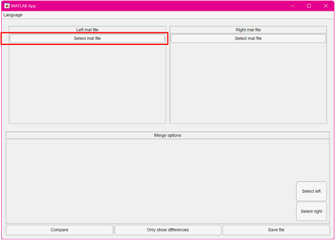
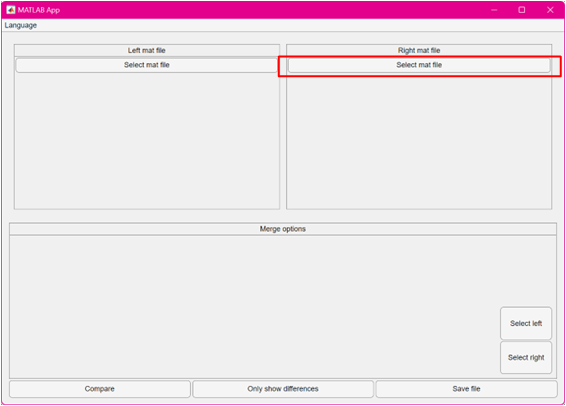
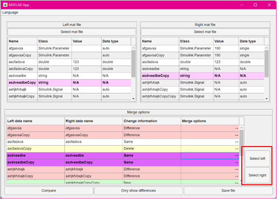
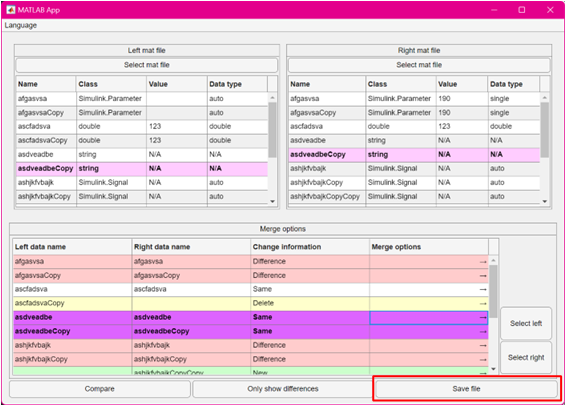

# matCompare

## Language

- [English](README.md)
- [中文](README_CN.md)

## Introduction

matCompare is a Matlab App for comparing and merging .mat files. Matlab's built-in comparison tool cannot specify multiple variables for one-time merging, and can only select a single variable for merging each time. After a single variable is merged, the comparison will be automatically rerun before the next variable can be merged. It is not convenient to use when there are many variables. To address this problem, this App has modified the comparison and merging methods.

## Install and run

### **Environment:**

1. Matlab 2023a and higher versions.
2. Simulink corresponding to the Matlab version.

### **Installation:**

1. Run Matlab.
2. Use Matlab to run the installation file 'matCompare.mlappinstall'.
3. In Matlab's 'App' tab, find 'matCompare' and click to run.

## Usage Instructions

Steps for use:

1. Run 'matCompare'.
2. Click the button in the image to select the mat file you want to compare.
   
3. Click the button in the image to select another mat file to compare.
   
4. Click the 'Compare' button.
5. (Optional) Click 'Only show differences'.
6. Click on a row in the comparison table and use the button encircled in the image to choose whether to use the left or right mat data for the selected row variable (right side data is default).
   
7. (Optional) Double-click a row in the comparison table to open Matlab's built-in comparison tool visdiff, to compare the differences in left and right data for the selected variable.
8. After making your selections, click save to save the merged mat file.
   
